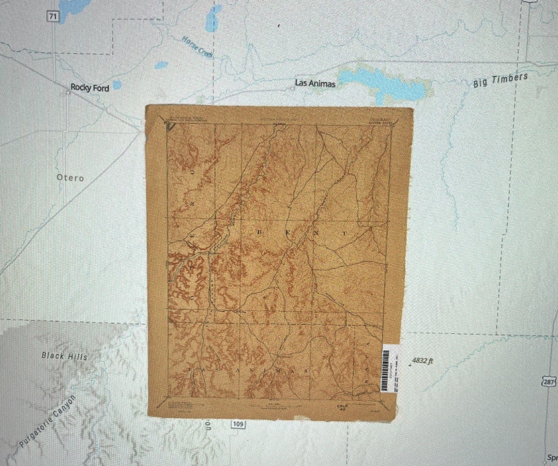
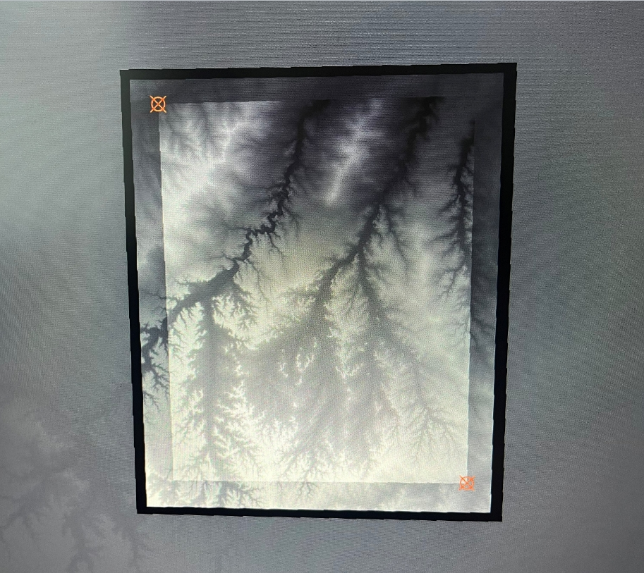
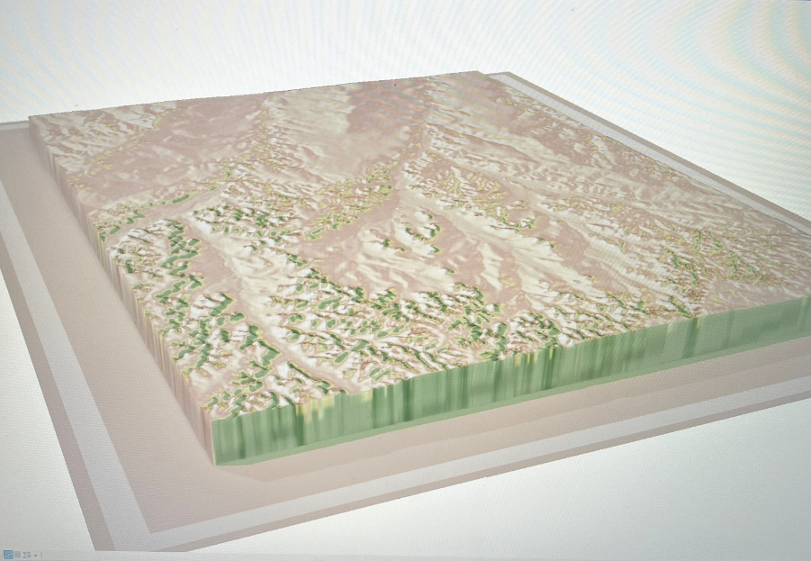

# Historic Map Georeferencing

## Overview

This project demonstrates a complete ArcGIS Pro workflow for georeferencing a historic topographic map, extracting elevation data, creating a hillshade, and blending the results to visualize terrain while preserving the original map.

- Georeferencing
- Control Point Management
- Spatial Reference Systems
- Raster Alignment
- Map Layout Design

## Files

- Finding and Georeferencing a Vintage Map Image.pdf
- Extracting Elevation Data to Match Your Map.pdf
- Creating a Hillshade and Blending it With Your Vintage Map.pdf

## Project Workflow

### Original Historic Map

### Georeferenced Map

### 3D Hillshade

